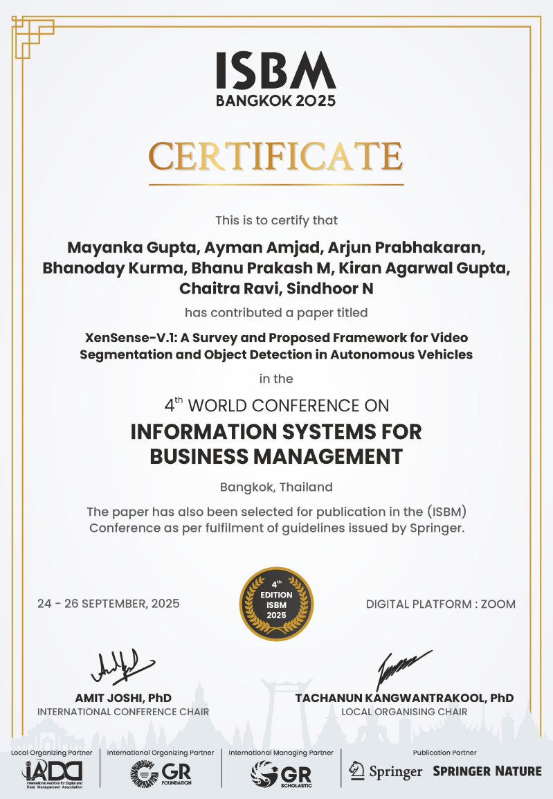
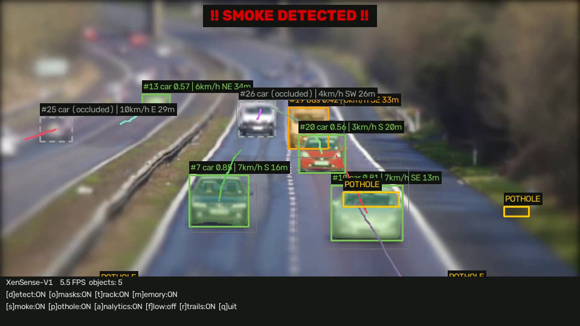
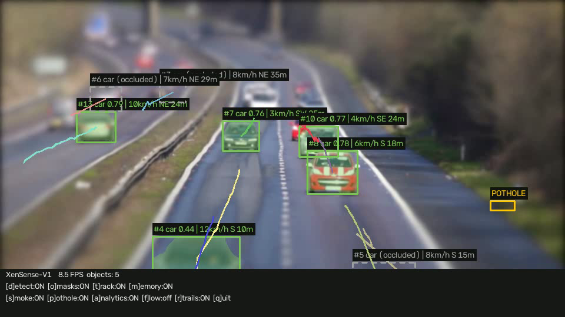
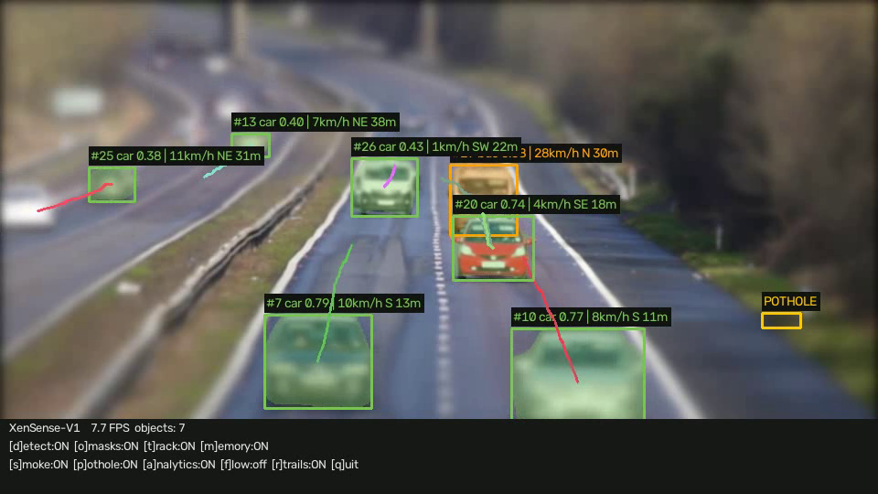
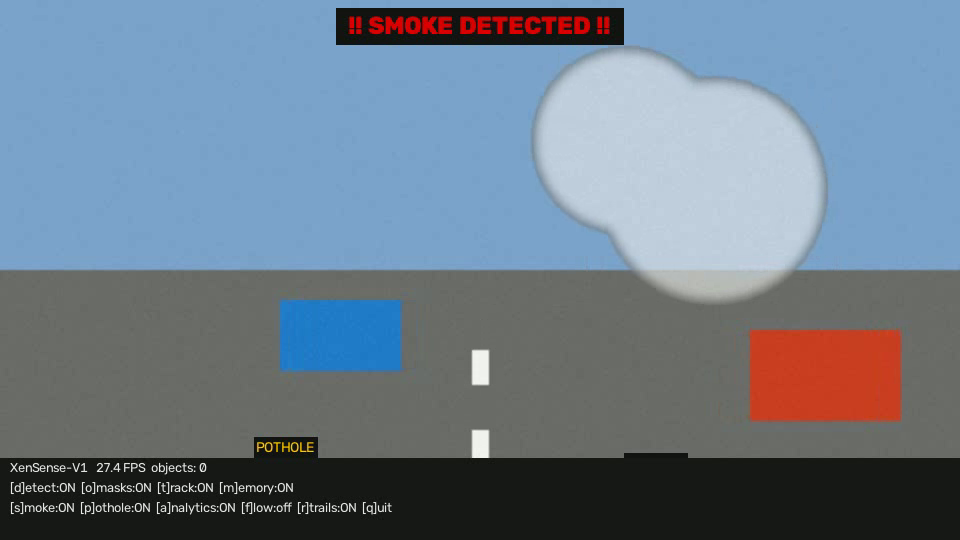

<div align="center">

# 🚗 XenSense-V1

### Real-Time Video Segmentation & Scene Understanding for Autonomous Driving

*A modular, real-time video perception pipeline that unifies **instance segmentation, multi-object tracking, hazard detection (smoke/fog & potholes), motion analytics, and occlusion-aware memory** into a single, togglable system — the practical implementation of the XenSense-V1 research report.*

<br/>

[](https://www.python.org/)
[](https://pytorch.org/)
[](https://docs.ultralytics.com/)
[](https://opencv.org/)
[](https://github.com/levan92/deep_sort_realtime)

[](#-certification--publication)

[](LICENSE)


</div>

---

## 🏅 Certification & Publication

> The research behind XenSense-V1 was **presented at an international conference and selected for publication by Springer.**

The paper **_"XenSense-V.1: A Survey and Proposed Framework for Video Segmentation and Object Detection in Autonomous Vehicles"_** was accepted and presented at the **4th World Conference on Information Systems for Business Management (ISBM 2025)**, held in **Bangkok, Thailand (24–26 September 2025)**, and was **selected for publication in the ISBM conference proceedings by Springer Nature**.

<div align="center">
  
</div>

<div align="center">

| | |
|---|---|
| 📄 **Paper** | XenSense-V.1: A Survey and Proposed Framework for Video Segmentation and Object Detection in Autonomous Vehicles |
| 🏛️ **Conference** | 4th World Conference on Information Systems for Business Management (ISBM 2025) |
| 📍 **Venue** | Bangkok, Thailand · 24–26 September 2025 |
| 📚 **Publication** | Selected for publication by **Springer Nature** |
| 👥 **Authors** | Mayanka Gupta, Ayman Amjad, Arjun Prabhakaran, Bhanoday Kurma, **Bhanu Prakash M**, Kiran Agarwal Gupta, Chaitra Ravi, Sindhoor N |

</div>

> This repository is the **practical implementation** that builds on and extends that published framework.

---

## 📖 Overview

**XenSense-V1** is a deep-learning framework for **video segmentation and semantic
labelling in autonomous-driving systems**. It ingests a video stream (file or
webcam) and produces a fully-annotated scene understanding in real time — then
lets you toggle every capability on and off, live, to see exactly what each one
contributes.

It is the practical implementation of the research report *"A Deep Learning-Based
Framework for Video Segmentation and Semantic Labelling in Autonomous Driving
Systems"* (BMS College of Engineering, VTU, 2024–25), with each software module
mapped directly to a section of the paper.

> **The one-liner:** frames flow through YOLOv8-seg → DeepSORT tracking →
> occlusion-aware memory, while parallel branches detect smoke/fog and potholes
> and compute per-object speed, direction and distance — all composited by a
> renderer into a live preview, an annotated `.mp4`, and CSV/JSON logs.

<div align="center">

**🎛️ Ten live toggles** &nbsp;·&nbsp; `d` detection · `o` masks · `t` tracking · `m` memory · `s` smoke · `p` pothole · `a` analytics · `f` flow · `r` trails · `h` HUD

</div>

---

## 📸 Results

### Full pipeline — *segmentation · tracking · analytics · hazards · HUD*
> Instance masks + boxes, DeepSORT track IDs, per-object **speed / 8-way direction / distance**, trajectory trails, pothole boxes, a **"SMOKE DETECTED"** hazard banner, and the live status HUD — all in one frame.

<div align="center">
  
</div>

<table>
  <tr>
    <td width="50%">
      <b>🧩 Segmentation & Tracking</b><br/>
      <sub>YOLOv8-seg masks with stable DeepSORT IDs and trajectory trails; occluded objects keep their identity.</sub><br/><br/>
      
    </td>
    <td width="50%">
      <b>📊 Motion Analytics</b><br/>
      <sub>Each tracked object carries estimated speed (km/h), compass direction, and monocular distance (m).</sub><br/><br/>
      
    </td>
  </tr>
</table>

<div align="center">
  <b>🧪 Synthetic hazard test</b><br/>
  <sub>A generated clip that deliberately exercises the smoke and pothole heuristics end-to-end.</sub><br/><br/>
  
</div>

---

## ✨ Features

| Capability | What it does |
|------------|--------------|
| 🎯 **Instance segmentation** | YOLOv8-seg produces boxes, class labels, confidence, and pixel-level instance masks. |
| 🔗 **Multi-object tracking** | DeepSORT (Kalman motion + appearance embeddings) assigns and holds stable track IDs. |
| 🧠 **Occlusion memory** | STM/SRNet-inspired recall re-attaches the original ID after transient occlusion instead of spawning a new one. |
| 🌫️ **Smoke / fog detection** | A lightweight CNN (~120k params) fused with colour + temporal cues, with a classical-vision fallback. |
| 🕳️ **Pothole detection** | Road-surface anomaly detection with temporal persistence (CBAM-YOLO path when weights are provided). |
| 📊 **Motion analytics** | Per-object speed, 8-way direction, monocular distance, and optional global optical-flow overlay. |
| 🎬 **Rendering & export** | Boxes, masks, trails, hazard banners, HUD → live preview + `.mp4`, plus per-frame CSV and a summary JSON. |
| 🎛️ **Modular toggles** | Every module flips on/off at runtime from the keyboard — ablate the system live. |

> 📐 A full breakdown — the pipeline diagram, the occlusion-memory recall, and the code⇄report module map — lives in **[`docs/ARCHITECTURE.md`](docs/ARCHITECTURE.md)**.

---

## 🛠️ Tech Stack

| Layer | Technology |
|-------|-----------|
| **Language** | Python 3.9+ (tested on 3.13, Windows / Ubuntu) |
| **Detection / Segmentation** | Ultralytics **YOLOv8n-seg** |
| **Tracking** | **DeepSORT** (`deep-sort-realtime`) — Kalman + appearance |
| **Deep learning** | PyTorch · TorchVision (custom SmokeCNN) |
| **Classical CV** | OpenCV (video I/O, optical flow, colour/temporal cues, rendering) |
| **Numerics** | NumPy |

---

## 🚀 Installation

Python 3.9+ (runs on CPU; a CUDA GPU is used automatically when available):

```bash
# 1. Clone the repository
git clone https://github.com/bhanu87777/XenSense-V1.git
cd XenSense-V1

# 2. Install dependencies
pip install -r requirements.txt
```

The YOLOv8 nano-seg weights (`yolov8n-seg.pt`, ~7 MB) download automatically on
first run — no manual setup required.

---

## 📋 Usage

```bash
# video file, live preview + annotated output video
python main.py --source data/drive.mp4 --output out/annotated.mp4

# webcam
python main.py --source 0

# headless benchmark (no window), all COCO classes
python main.py --source data/drive.mp4 --no-display --all-classes

# larger model for accuracy (yolov8s-seg / yolov8m-seg)
python main.py --source data/drive.mp4 --model yolov8s-seg.pt
```

### Runtime toggles *(preview window focused)*
`d` detection · `o` masks · `t` tracking · `m` memory · `s` smoke · `p` pothole · `a` analytics · `f` optical flow · `r` trails · `h` HUD · `q` quit

### Quick self-test
```bash
# real highway clip, first 150 frames, headless
python main.py --source data/test.mp4 --no-display --max-frames 150 --output out/test_annotated.mp4

# synthetic clip exercising the smoke + pothole heuristics end-to-end
python scripts/make_test_video.py          # writes data/synthetic_test.mp4
python main.py --source data/synthetic_test.mp4 --no-display --output out/synth.mp4
```

### Outputs
- Live annotated preview and optional `.mp4` (boxes, masks, track IDs, trails, speed/direction/distance, hazard banners).
- `logs/xensense_<timestamp>.csv` — per-frame, per-object rows.
- `logs/xensense_<timestamp>_summary.json` — class counts, unique objects, smoke/fog event ranges, average FPS.

> **Analytics caveat:** speed/direction come from pixel displacement with monocular size priors, so values are **relative to the camera** — on a moving dash-cam, a car at the ego-vehicle's speed reads near 0 km/h. Ego-motion compensation is future work (report §1.4).

---

## 🔧 Upgrading the hazard detectors

Both hazard modules work out of the box with classical-vision fallbacks and
upgrade automatically to deep models when weights are present:

- **Smoke/fog CNN** — organise images as `data/smoke_dataset/{smoke,clear}/*.jpg` (e.g. RESIDE/RTTS frames) and run
  `python scripts/train_smoke.py --data data/smoke_dataset --epochs 15`.
  Weights save to `weights/smoke_cnn.pt` and are picked up automatically.
- **Pothole YOLO** — train any Ultralytics YOLO on a pothole dataset (RDD2022 / a Roboflow set) and drop the weights at `weights/pothole_yolo.pt`.

---

## 📁 Project Structure

```
XenSense-V1/
├── main.py                     # CLI entry point
├── requirements.txt
├── xensense/
│   ├── config.py               # all toggles + thresholds + size priors
│   ├── pipeline.py             # orchestrator / main loop
│   ├── models/
│   │   └── smoke_cnn.py        # lightweight SmokeCNN (~120k params)
│   └── modules/
│       ├── preprocessing.py    # frame extraction & prep
│       ├── segmentation.py     # YOLOv8-seg
│       ├── tracking.py         # DeepSORT (Kalman + appearance)
│       ├── memory.py           # occlusion recall
│       ├── smoke_detection.py  # smoke / fog
│       ├── pothole_detection.py# road-surface anomalies
│       ├── analytics.py        # speed / direction / distance / flow
│       ├── renderer.py         # overlays, banners, HUD
│       └── exporter.py         # CSV / JSON export
├── scripts/
│   ├── train_smoke.py          # smoke CNN training
│   └── make_test_video.py      # synthetic end-to-end test clip
├── weights/                    # optional trained weights (smoke_cnn.pt, pothole_yolo.pt)
├── assets/screenshots/         # README imagery
└── docs/
    ├── ARCHITECTURE.md         # pipeline & module deep dive
    ├── XenSense-V1_Research_Report.pdf
    ├── XenSenseV1_1_Results_Walkthrough.pdf
    └── XenSenseV1_2_Codebase_Guide.pdf
```

---

## 🔭 Future Improvements

- [ ] **Ego-motion compensation** — subtract camera motion for true (not relative) object speeds
- [ ] **Multi-sensor fusion** — LiDAR / radar depth for metric distance (report §1.4)
- [ ] **TensorRT export** — Jetson-class real-time deployment (`yolo export … format=engine`)
- [ ] **Lane & drivable-area segmentation** as an additional module
- [ ] **Trained hazard weights shipped** — bundle SmokeCNN / pothole-YOLO checkpoints
- [ ] **Evaluation harness** — quantitative mAP / MOTA / FPS benchmarking against report targets
- [ ] **Web dashboard** — stream annotated output + live analytics to a browser

---

## 🤝 Contributing

Contributions, issues, and feature requests are welcome!

1. Fork the project
2. Create your feature branch (`git checkout -b feature/amazing-feature`)
3. Commit your changes (`git commit -m 'Add amazing feature'`)
4. Push to the branch (`git push origin feature/amazing-feature`)
5. Open a Pull Request

---

## 📄 License

Distributed under the **MIT License**. See [`LICENSE`](LICENSE) for details.

> Academic work associated with BMS College of Engineering (VTU, 2024–25). Movie
> classes and detection come from the pretrained COCO YOLOv8 model; datasets
> referenced for hazard training (RESIDE/RTTS, RDD2022) belong to their respective
> owners.

---

## 👤 Author

**Bhanu Prakash M**

[](https://github.com/bhanu87777)

> 💡 If XenSense-V1 helped or impressed you, consider giving the repo a ⭐ — it genuinely helps!

<div align="center">
<sub>Built with Python, YOLOv8, DeepSORT, and OpenCV — real-time perception, one togglable module at a time.</sub>
</div>
