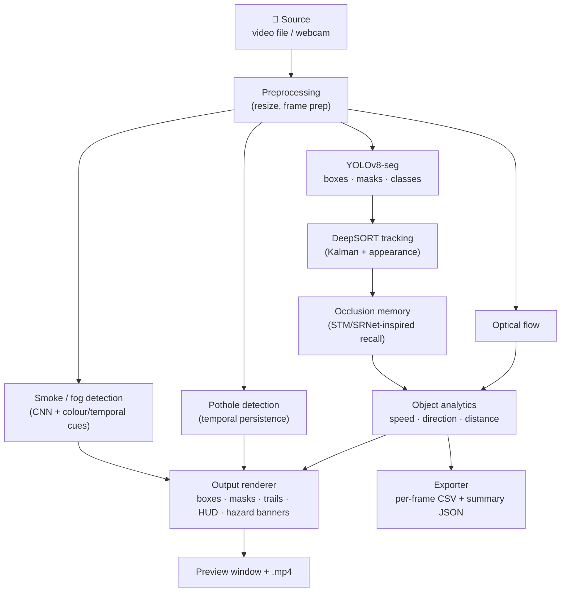

# 🏗️ XenSense-V1 — Architecture

A modular, real-time video perception pipeline for autonomous-driving systems.
One `xensense/` Python package, orchestrated by `main.py`; **every capability is
its own module** and can be toggled on/off at runtime.

---

## 1. The pipeline



All resolvable in real time; on a preview window each stage is a **keyboard
toggle**, so you can turn any capability on/off live to see its contribution.

---

## 2. Module map (code ⇄ research report)

| Module | File | Report § |
|--------|------|:--------:|
| Frame extraction & preprocessing | `xensense/modules/preprocessing.py` | 1.7.1, 4.3 |
| YOLOv8 segmentation & semantic labelling | `xensense/modules/segmentation.py` | 4.2 |
| DeepSORT tracking (Kalman + appearance) | `xensense/modules/tracking.py` | 4.2 |
| Occlusion memory recall (STM/SRNet-inspired) | `xensense/modules/memory.py` | 2.4 |
| Smoke / fog detection (CNN + colour/temporal cues) | `xensense/modules/smoke_detection.py`, `xensense/models/smoke_cnn.py` | 1.7.1, 4.2 |
| Pothole / speed-bump detection (temporal persistence) | `xensense/modules/pothole_detection.py` | 2.2.6, 4.2 |
| Object analytics (speed, direction, monocular distance, optical flow) | `xensense/modules/analytics.py` | 2.2.5, 4.2 |
| Output renderer (boxes, masks, trails, hazard banners, HUD) | `xensense/modules/renderer.py` | 4.2 |
| CSV / JSON export & hazard summary | `xensense/modules/exporter.py` | 4.3 |
| Orchestrator + runtime toggles | `xensense/pipeline.py`, `xensense/config.py` | 3.2, 4.1 |

> The full academic write-up lives in **[`docs/XenSense-V1_Research_Report.pdf`](XenSense-V1_Research_Report.pdf)** (BMS College of Engineering, VTU, 2024–25).

---

## 3. Design principles

- **Modular toggling (report §3.2).** Every capability is a discrete module behind
  a boolean toggle in `xensense/config.py` (`ModuleToggles`) — flippable live from
  the preview window (`d o t m s p a f r h`). This makes the contribution of each
  stage observable and the system easy to ablate.

- **Config-driven tuning.** All thresholds, size priors, and class filters live in
  `xensense/config.py`, so tuning never requires touching module code.

- **Graceful degradation.** Both hazard detectors ship with **classical-vision
  fallbacks** and upgrade automatically to deep models when trained weights are
  present (`weights/smoke_cnn.pt`, `weights/pothole_yolo.pt`) — so the pipeline
  runs end-to-end with zero extra setup.

- **CPU-first, GPU-accelerated.** Runs on CPU out of the box; a CUDA GPU is used
  automatically when available. The nano YOLO model keeps it edge-deployable
  (Jetson-class, exportable to TensorRT).

---

## 4. Occlusion memory (the interesting bit)

When a tracked object is briefly occluded, DeepSORT can lose the ID. Each track
stores its last box, a smoothed velocity, and an appearance signature; when a new
detection appears near the memory's predicted position with a matching appearance,
the **original ID is recalled** rather than a new one being spawned — so identities
survive transient occlusion ("ghost" recall, report §2.4).

---

## 5. Analytics — an honest caveat

Speed and direction are derived from **pixel displacement** with monocular size
priors, so values are **relative to the camera**. On a moving dash-cam, a car
travelling at the ego-vehicle's speed reads near 0 km/h. Ego-motion compensation
(multi-sensor fusion) is listed as future work in the report (§1.4).

---

## 6. Outputs

- **Live annotated preview** and optional **`.mp4`** — boxes, instance masks,
  track IDs, trajectory trails, per-object speed/direction/distance, hazard
  banners, and a status HUD.
- **`logs/xensense_<timestamp>.csv`** — per-frame, per-object rows.
- **`logs/xensense_<timestamp>_summary.json`** — class counts, unique object
  counts, smoke/fog event ranges, and average FPS.

---

## 7. Project layout

```
main.py                      CLI entry point (argparse → Config → pipeline)
xensense/
  config.py                  all toggles + thresholds + size priors
  pipeline.py                orchestrator / main loop
  models/smoke_cnn.py        lightweight SmokeCNN (~120k params)
  modules/                   one file per report module (see table above)
scripts/
  train_smoke.py             smoke CNN training
  make_test_video.py         synthetic end-to-end test clip
weights/                     optional trained weights (smoke_cnn.pt, pothole_yolo.pt)
data/                        input clips (gitignored)
logs/ · out/                 runtime exports & annotated media (gitignored)
docs/                        research report + walkthrough PDFs
```
